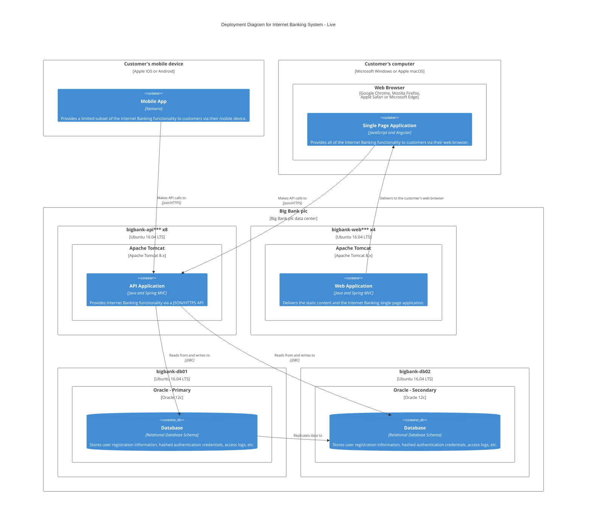

# Example of a C4 Deployment Diagram in Mermaid

## C4 Deployment Diagram definition
A deployment diagram allows you to illustrate how instances of software systems and/or containers in the static model are deployed on to the infrastructure within a given deployment environment (e.g. production, staging, development, etc). It’s based upon a UML deployment diagram.

A deployment node represents where an instance of a software system/container is running; perhaps physical infrastructure (e.g. a physical server or device), virtualised infrastructure (e.g. IaaS, PaaS, a virtual machine), containerised infrastructure (e.g. a Docker container), an execution environment (e.g. a database server, Java EE web/application server, Microsoft IIS), etc. Deployment nodes can be nested.

You may also want to include infrastructure nodes such as DNS services, load balancers, firewalls, etc.

Feel free to use icons provided by Amazon Web Services, Azure, etc to complement your deployment diagrams … just make sure any icons you use are included in your diagram key/legend.

## C4 Deployment Diagram Mermaid example
