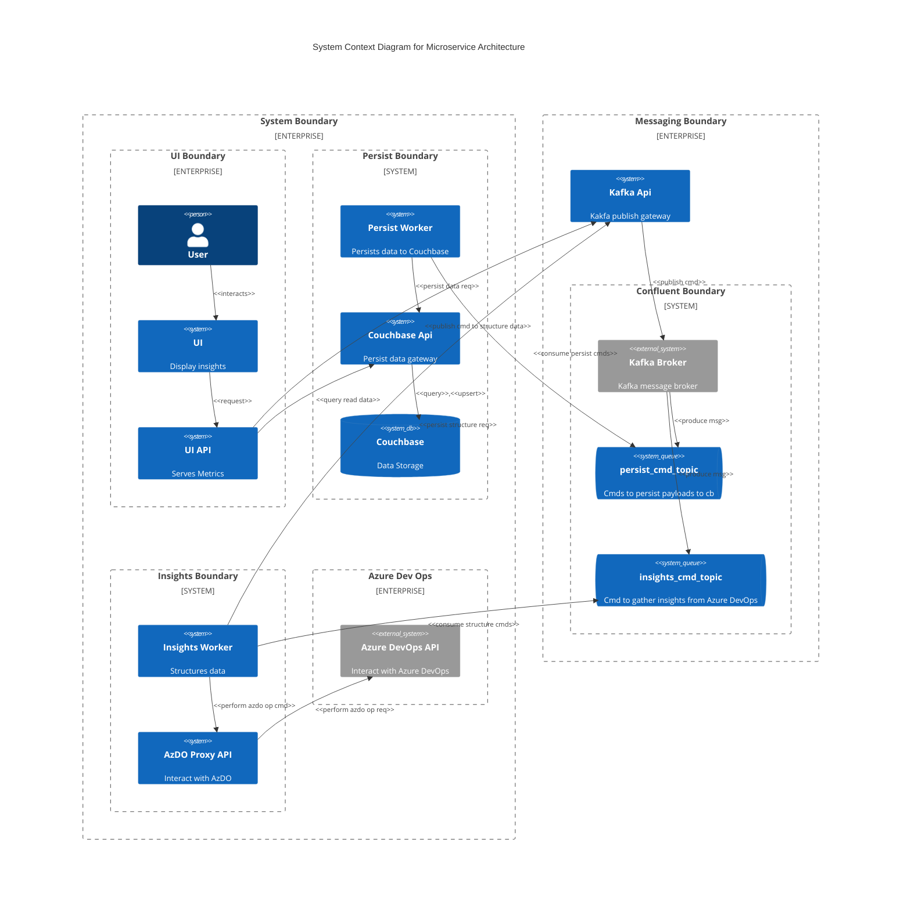

# Example of a C4 diagram in Mermaid

This is an example of a C4 diagram.
It depicts a microservice architecture. 
It is a system that gathers work item data from Azure DevOps, structures it in a summarized hierarchical tree structure, and persists it to a store.
The tree structures are used to draw charts on the UI, which is a web application.

**UI**
Web application used to display charts that represent the health of a project.

**UI API**
Acts as a gateway to the backend services.
- Endpoint for querying for data
- Endpoint for publishing a request to rebuild a data structures

**Kafka API**
- Enpoint for publishing messages to Kafka

**Cuchbase API**
- Endpoint for querying data in Couchbase
- Endpoint for persisting data to Couchbase

**Persist Worker**
- Consume messages off a dedicated 'persist' topic
- Persist data to Couchbase, through the Couchbase API

**Insights Worker**
- Consume messages off a dedicated 'insights' command topic
- Gather work item details from Azure DevOps
- Structure data in a summarized tree format
- Persist tree structure through by publishing a persit command to Kafka, through the Kafka API

