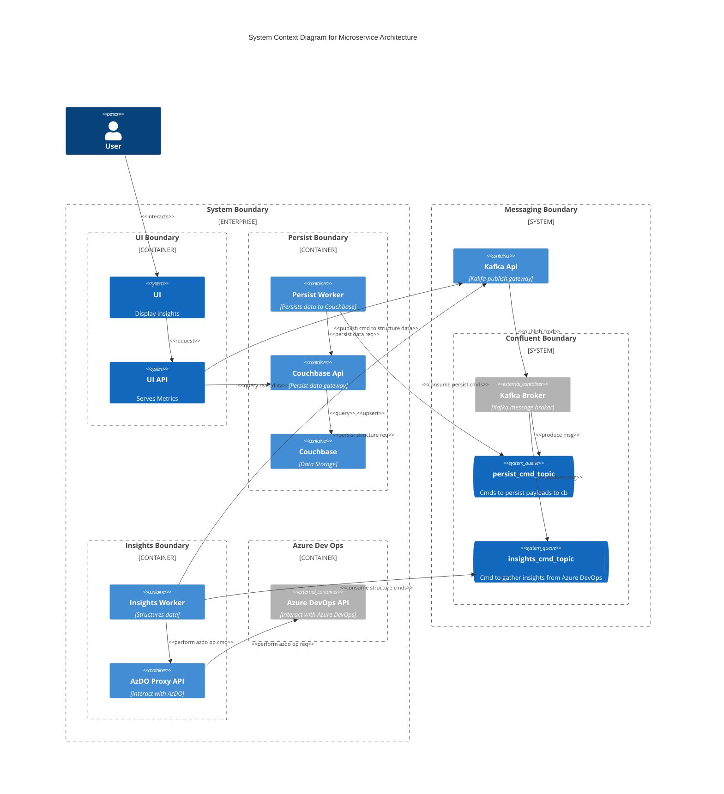

# Example of a C4 Container Diagram in Mermaid

## Overview
This is an example of a C4 Container diagram.
It depicts a microservice architecture. 
It is a system that gathers Work Items from the Azure DevOps API, Work Items are summarized and then structured into hierarchical tree structure, and persisted to a store.
The tree structure is used by the D3.js charting library in the user-facing web application.

## Summary of containers

**UI**
Web application used to display charts that represent the health of a project.

**UI API**
Acts as a gateway to the backend services.
- Endpoint for querying for data
- Endpoint for publishing a request to rebuild a data structures

**Kafka API**
- Enpoint for publishing messages to Kafka

**Cuchbase API**
- Endpoint for querying data in Couchbase
- Endpoint for persisting data to Couchbase

**Persist Worker**
- Consume messages off a dedicated 'persist' topic
- Persist data to Couchbase, through the Couchbase API

**Insights Worker**
- Consume messages off a dedicated 'insights' command topic
- Gather work item details from Azure DevOps
- Structure data in a summarized tree format
- Persist tree structure through by publishing a persit command to Kafka, through the Kafka API

## Diagram

