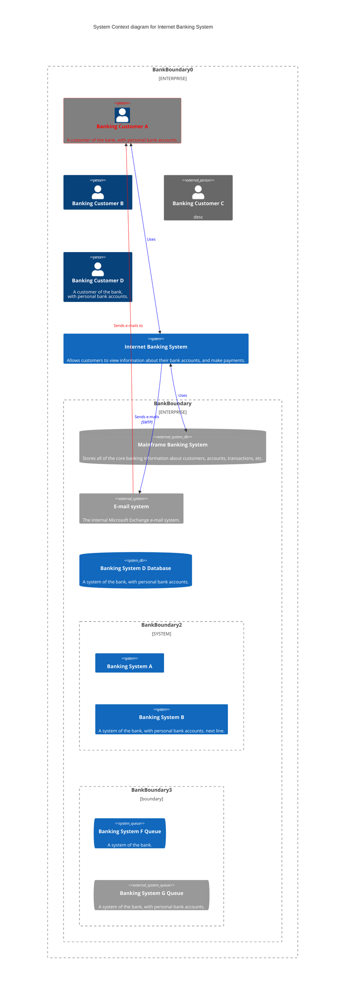

# Example of a C4 System Context Diagram in Mermaid

## C4 System Context Diagram definition
A System Context diagram is a good starting point for diagramming and documenting a software system, allowing you to step back and see the big picture. Draw a diagram showing your system as a box in the centre, surrounded by its users and the other systems that it interacts with.

Detail isn’t important here as this is your zoomed out view showing a big picture of the system landscape. The focus should be on people (actors, roles, personas, etc) and software systems rather than technologies, protocols and other low-level details. It’s the sort of diagram that you could show to non-technical people.

In a C4 context diagram, the entire system (composed of multiple microservices potentially) would typically be depicted as a single block representing the entire system.
This block would show how the product (or system) interacts with external users (people) and external systems (dependent systems or services).

## What a C4 Context Diagram Would Depict:
The System: This is represented as a single block, treating the product as a cohesive system. 
It doesn't go into the details of internal microservices at this level.
Users/Actors: The context diagram will show the external users or actors (e.g., customers, administrators, third-party systems) who interact with the product. These are typically depicted as individual blocks or icons labeled with their roles.
External Systems: Any external systems or services that the product interacts with are also represented as blocks. These might be third-party services, databases, or other systems that the product communicates with.

## C4 System Context Diagram Mermaid example
