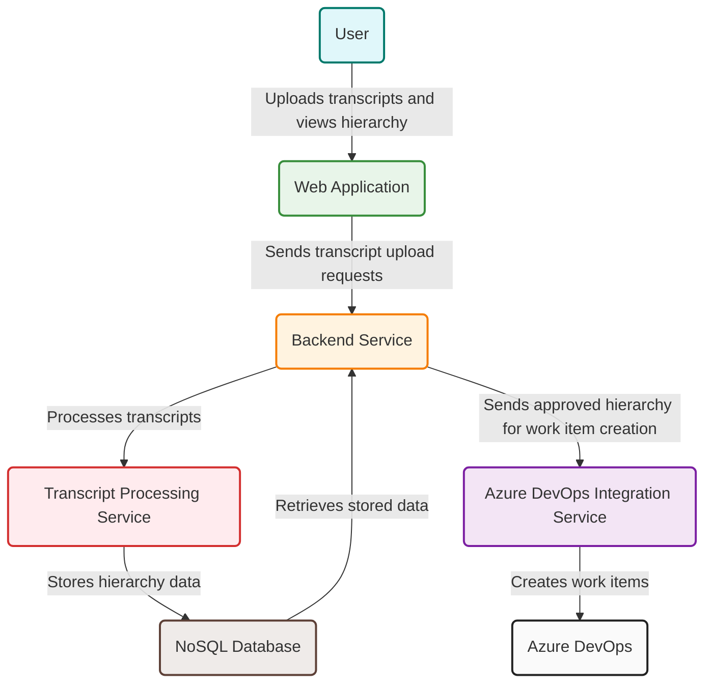

```mermaid
flowchart TB
    user(User)
    webApp(Web Application)
    backendService(Backend Service)
    transcriptService(Transcript Processing Service)
    devOpsService(Azure DevOps Integration Service)
    database(NoSQL Database)
    azureDevOps(Azure DevOps)

    user -->|Uploads transcripts and views hierarchy| webApp
    webApp -->|Sends transcript upload requests| backendService
    backendService -->|Processes transcripts| transcriptService
    transcriptService -->|Stores hierarchy data| database
    backendService -->|Sends approved hierarchy for work item creation| devOpsService
    devOpsService -->|Creates work items| azureDevOps
    database -->|Retrieves stored data| backendService

    classDef blue fill:#E0F7FA,stroke:#00796B,stroke-width:2px;
    classDef green fill:#E8F5E9,stroke:#388E3C,stroke-width:2px;
    classDef orange fill:#FFF3E0,stroke:#F57C00,stroke-width:2px;
    classDef red fill:#FFEBEE,stroke:#D32F2F,stroke-width:2px;
    classDef purple fill:#F3E5F5,stroke:#7B1FA2,stroke-width:2px;
    classDef brown fill:#EFEBE9,stroke:#5D4037,stroke-width:2px;
    classDef black fill:#FAFAFA,stroke:#212121,stroke-width:2px;

    class user blue;
    class webApp green;
    class backendService orange;
    class transcriptService red;
    class devOpsService purple;
    class database brown;
    class azureDevOps black;
```
