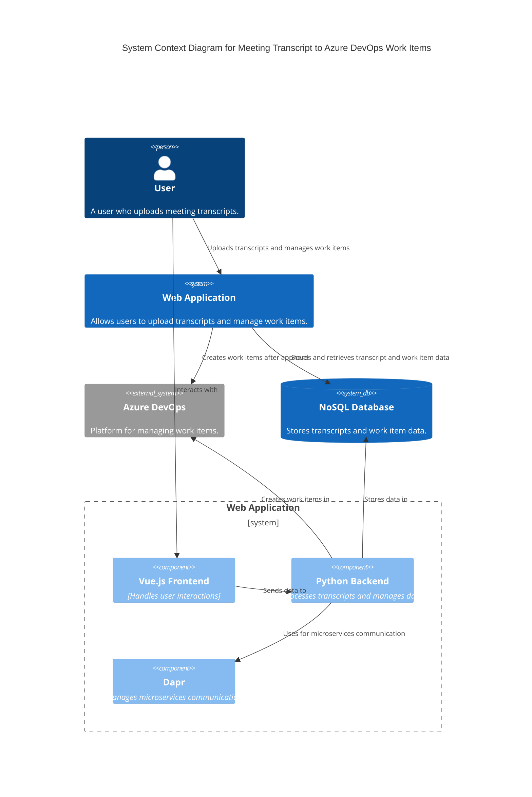

### Explanation

- **User**: The person who uploads meeting transcripts to the web application.
- **Web Application**: The main system that allows users to upload transcripts and manage work items.
  - **Vue.js Frontend**: Handles user interactions and displays the work item hierarchy.
  - **Python Backend**: Processes the transcripts, builds the work item hierarchy, and communicates with Azure DevOps.
  - **Dapr**: Used for managing microservices communication within the web application.
- **Azure DevOps**: External system where the work items are created after user approval.
- **NoSQL Database**: Stores the transcripts and work item data, supporting horizontal scaling and large data storage.

This diagram represents the high-level architecture of the system, showing how the user interacts with the web application and how the application interfaces with Azure DevOps and the database.