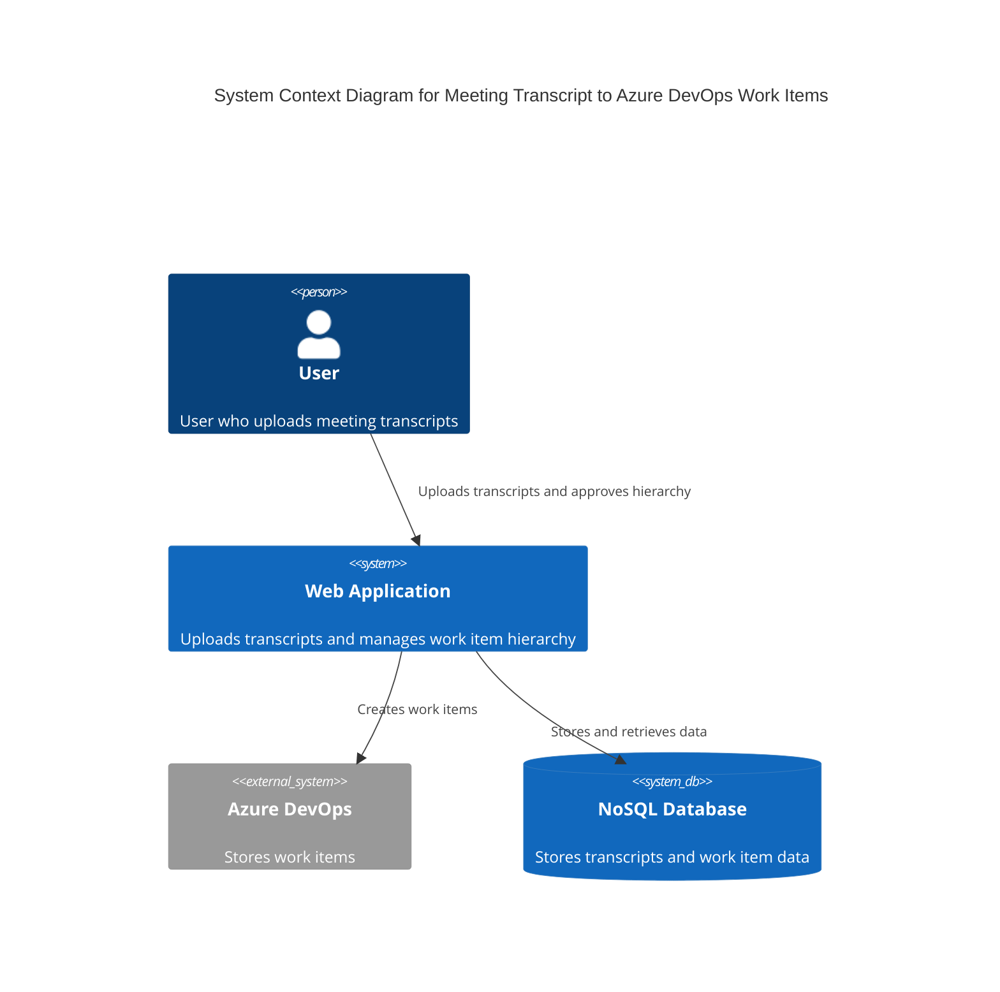

### Explanation

- **User**: The person who uploads meeting transcripts and approves the work item hierarchy.
- **Web Application**: The main system where users upload transcripts and manage the work item hierarchy. It handles requests, processes data, and interacts with Azure DevOps and the database.
- **Azure DevOps**: External system where the work items are stored once approved.
- **NoSQL Database**: Stores the transcripts and work item data, supporting horizontal scaling and large data storage.

The system is designed to handle high throughput and large data volumes, using Dapr for microservices and Vue.js for the frontend, with Python on the backend.