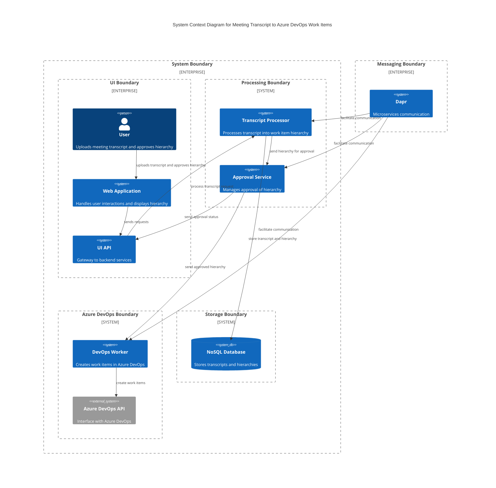

### Explanation

- **User**: Interacts with the web application to upload transcripts and approve the generated work item hierarchy.
- **Web Application (UI)**: Provides the interface for users to interact with the system.
- **UI API**: Acts as a gateway to the backend services, handling requests from the UI.
- **Transcript Processor**: Processes the uploaded transcript to generate a work item hierarchy.
- **Approval Service**: Manages the approval process for the generated hierarchy.
- **DevOps Worker**: Responsible for creating work items in Azure DevOps once the hierarchy is approved.
- **Azure DevOps API**: External system interface for creating work items in Azure DevOps.
- **NoSQL Database**: Stores the transcripts and the generated hierarchies.
- **Dapr**: Facilitates communication between microservices, ensuring scalability and reliability.

This architecture is designed to handle high throughput and large data storage requirements, leveraging Dapr for microservices communication and a NoSQL database for storage. The system is scalable and can handle the specified technical requirements effectively.