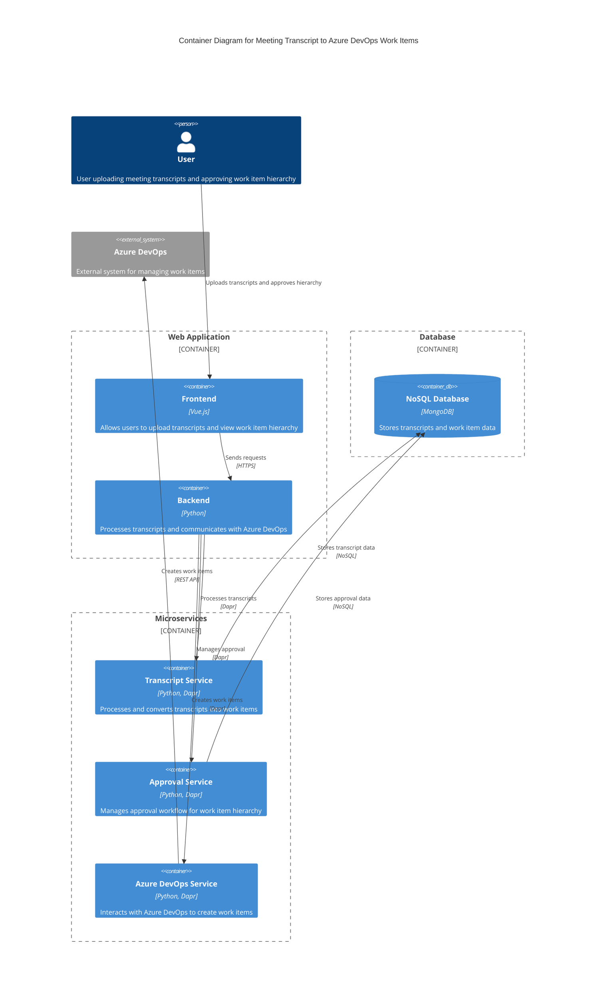

```mermaid
C4Container
title Container Diagram for Meeting Transcript to Azure DevOps Work Items

Person(user, "User", "User uploading meeting transcripts and approving work item hierarchy")

Container_Boundary(webAppBoundary, "Web Application") {
    Container(frontend, "Frontend", "Vue.js", "Allows users to upload transcripts and view work item hierarchy")
    Container(backend, "Backend", "Python", "Processes transcripts and communicates with Azure DevOps")
}

Container_Boundary(databaseBoundary, "Database") {
    ContainerDb(noSqlDb, "NoSQL Database", "MongoDB", "Stores transcripts and work item data")
}

Container_Boundary(microservicesBoundary, "Microservices") {
    Container(transcriptService, "Transcript Service", "Python, Dapr", "Processes and converts transcripts into work items")
    Container(approvalService, "Approval Service", "Python, Dapr", "Manages approval workflow for work item hierarchy")
    Container(devOpsService, "Azure DevOps Service", "Python, Dapr", "Interacts with Azure DevOps to create work items")
}

System_Ext(azureDevOps, "Azure DevOps", "External system for managing work items")

Rel(user, frontend, "Uploads transcripts and approves hierarchy")
Rel(frontend, backend, "Sends requests", "HTTPS")
Rel(backend, transcriptService, "Processes transcripts", "Dapr")
Rel(backend, approvalService, "Manages approval", "Dapr")
Rel(backend, devOpsService, "Creates work items", "Dapr")
Rel(transcriptService, noSqlDb, "Stores transcript data", "NoSQL")
Rel(approvalService, noSqlDb, "Stores approval data", "NoSQL")
Rel(devOpsService, azureDevOps, "Creates work items", "REST API")
```