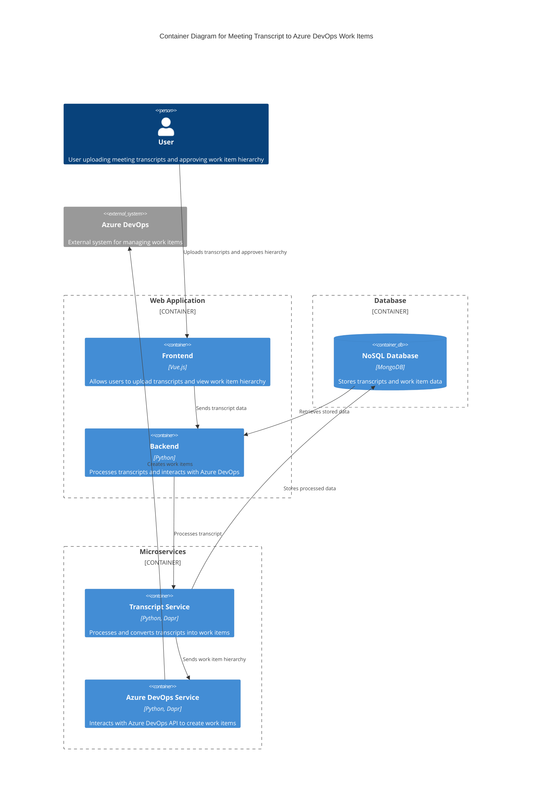

```mermaid
C4Container
title Container Diagram for Meeting Transcript to Azure DevOps Work Items

Person(user, "User", "User uploading meeting transcripts and approving work item hierarchy")

Container_Boundary(webAppBoundary, "Web Application") {
    Container(frontend, "Frontend", "Vue.js", "Allows users to upload transcripts and view work item hierarchy")
    Container(backend, "Backend", "Python", "Processes transcripts and interacts with Azure DevOps")
}

Container_Boundary(databaseBoundary, "Database") {
    ContainerDb(noSqlDb, "NoSQL Database", "MongoDB", "Stores transcripts and work item data")
}

Container_Boundary(microservicesBoundary, "Microservices") {
    Container(transcriptService, "Transcript Service", "Python, Dapr", "Processes and converts transcripts into work items")
    Container(azureDevOpsService, "Azure DevOps Service", "Python, Dapr", "Interacts with Azure DevOps API to create work items")
}

System_Ext(azureDevOps, "Azure DevOps", "External system for managing work items")

Rel(user, frontend, "Uploads transcripts and approves hierarchy")
Rel(frontend, backend, "Sends transcript data")
Rel(backend, transcriptService, "Processes transcript")
Rel(transcriptService, noSqlDb, "Stores processed data")
Rel(transcriptService, azureDevOpsService, "Sends work item hierarchy")
Rel(azureDevOpsService, azureDevOps, "Creates work items")
Rel(noSqlDb, backend, "Retrieves stored data")

```
