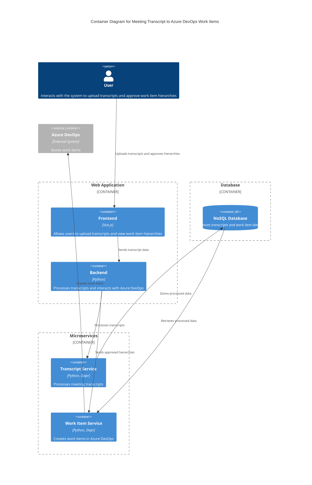

```mermaid
C4Container
title Container Diagram for Meeting Transcript to Azure DevOps Work Items

Person(user, "User", "Interacts with the system to upload transcripts and approve work item hierarchies")

Container_Boundary(webAppBoundary, "Web Application") {
    Container(frontend, "Frontend", "Vue.js", "Allows users to upload transcripts and view work item hierarchies")
    Container(backend, "Backend", "Python", "Processes transcripts and interacts with Azure DevOps")
}

Container_Boundary(databaseBoundary, "Database") {
    ContainerDb(database, "NoSQL Database", "Stores transcripts and work item data")
}

Container_Boundary(microservicesBoundary, "Microservices") {
    Container(transcriptService, "Transcript Service", "Python, Dapr", "Processes meeting transcripts")
    Container(workItemService, "Work Item Service", "Python, Dapr", "Creates work items in Azure DevOps")
}

Container_Ext(azureDevOps, "Azure DevOps", "External System", "Stores work items")

Rel(user, frontend, "Uploads transcripts and approves hierarchies")
Rel(frontend, backend, "Sends transcript data")
Rel(backend, transcriptService, "Processes transcripts")
Rel(transcriptService, database, "Stores processed data")
Rel(backend, workItemService, "Sends approved hierarchies")
Rel(workItemService, azureDevOps, "Creates work items")
Rel(database, workItemService, "Retrieves processed data")
```