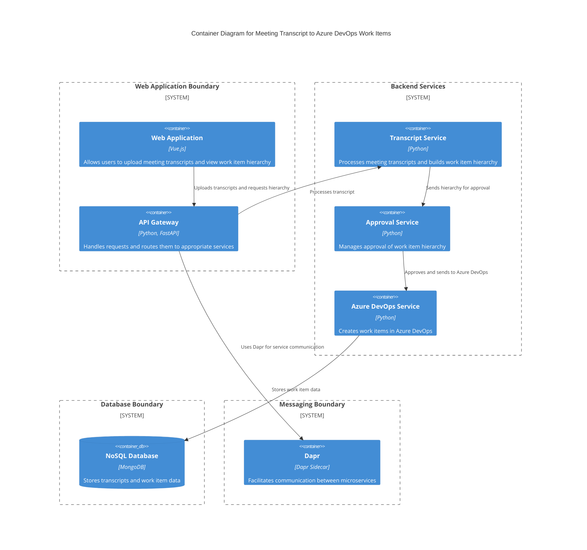

### Explanation

- **Web Application**: Built with Vue.js, this component allows users to upload meeting transcripts and view the generated work item hierarchy.
- **API Gateway**: Developed using Python and FastAPI, it routes incoming requests to the appropriate backend services.
- **Transcript Service**: Processes the uploaded meeting transcripts and constructs a hierarchy of work items.
- **Approval Service**: Manages the approval process for the generated work item hierarchy.
- **Azure DevOps Service**: Responsible for creating work items in Azure DevOps once the hierarchy is approved.
- **NoSQL Database**: Utilizes MongoDB to store transcripts and work item data.
- **Dapr**: Used as a sidecar to facilitate communication between microservices, ensuring scalability and resilience.