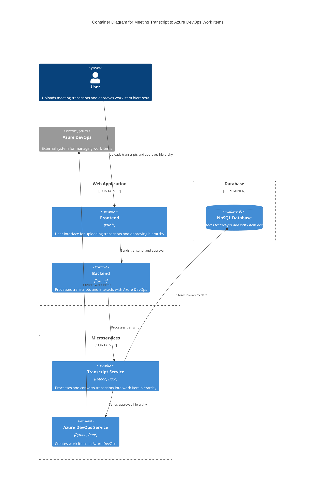

```mermaid
C4Container
title Container Diagram for Meeting Transcript to Azure DevOps Work Items

Person(user, "User", "Uploads meeting transcripts and approves work item hierarchy")

Container_Boundary(webAppBoundary, "Web Application") {
    Container(frontend, "Frontend", "Vue.js", "User interface for uploading transcripts and approving hierarchy")
    Container(backend, "Backend", "Python", "Processes transcripts and interacts with Azure DevOps")
}

Container_Boundary(databaseBoundary, "Database") {
    ContainerDb(noSqlDb, "NoSQL Database", "Stores transcripts and work item data")
}

Container_Boundary(microservicesBoundary, "Microservices") {
    Container(transcriptService, "Transcript Service", "Python, Dapr", "Processes and converts transcripts into work item hierarchy")
    Container(azureDevOpsService, "Azure DevOps Service", "Python, Dapr", "Creates work items in Azure DevOps")
}

System_Ext(azureDevOps, "Azure DevOps", "External system for managing work items")

Rel(user, frontend, "Uploads transcripts and approves hierarchy")
Rel(frontend, backend, "Sends transcript and approval")
Rel(backend, transcriptService, "Processes transcript")
Rel(transcriptService, noSqlDb, "Stores hierarchy data")
Rel(transcriptService, azureDevOpsService, "Sends approved hierarchy")
Rel(azureDevOpsService, azureDevOps, "Creates work items")
```
