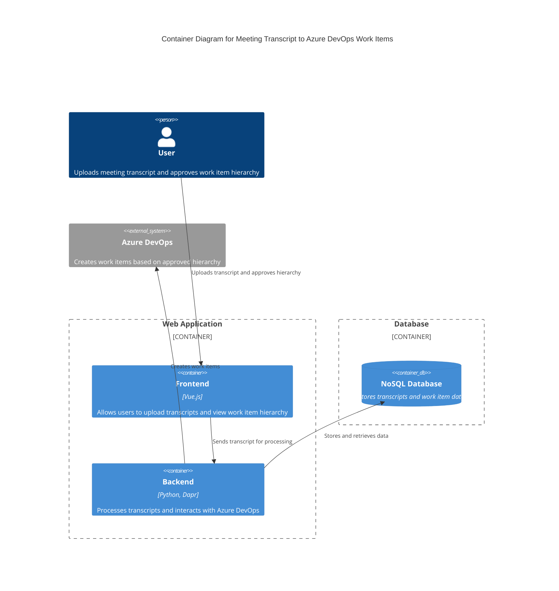

### Explanation
- **User**: Interacts with the system by uploading meeting transcripts and approving the work item hierarchy.
- **Frontend (Vue.js)**: Provides the user interface for uploading transcripts and viewing the work item hierarchy.
- **Backend (Python, Dapr)**: Handles the processing of transcripts, building the work item hierarchy, and communicating with Azure DevOps.
- **NoSQL Database**: Stores the transcripts and work item data, supporting horizontal scaling and large data storage.
- **Azure DevOps**: External system where the work items are created once the hierarchy is approved.