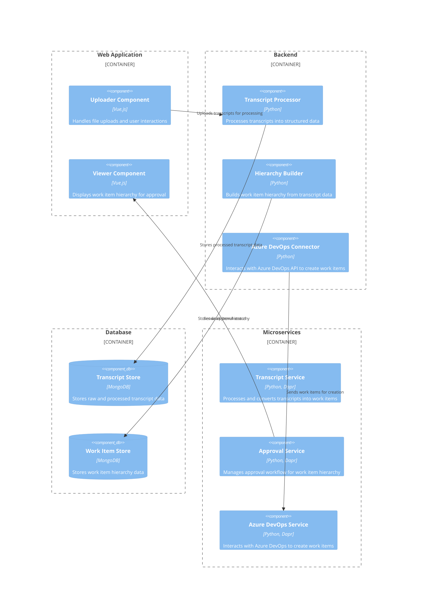

```mermaid
C4Component

Container_Boundary(webAppBoundary, "Web Application") {
    Component(frontendUploader, "Uploader Component", "Vue.js", "Handles file uploads and user interactions")
    Component(frontendViewer, "Viewer Component", "Vue.js", "Displays work item hierarchy for approval")
}

Container_Boundary(backendBoundary, "Backend") {
    Component(transcriptProcessor, "Transcript Processor", "Python", "Processes transcripts into structured data")
    Component(hierarchyBuilder, "Hierarchy Builder", "Python", "Builds work item hierarchy from transcript data")
    Component(azureDevOpsConnector, "Azure DevOps Connector", "Python", "Interacts with Azure DevOps API to create work items")
}

Container_Boundary(databaseBoundary, "Database") {
    ComponentDb(transcriptStore, "Transcript Store", "MongoDB", "Stores raw and processed transcript data")
    ComponentDb(workItemStore, "Work Item Store", "MongoDB", "Stores work item hierarchy data")
}

Container_Boundary(microservicesBoundary, "Microservices") {
    Component(transcriptService, "Transcript Service", "Python, Dapr", "Processes and converts transcripts into work items")
    Component(approvalService, "Approval Service", "Python, Dapr", "Manages approval workflow for work item hierarchy")
    Component(devOpsService, "Azure DevOps Service", "Python, Dapr", "Interacts with Azure DevOps to create work items")
}

Rel(frontendUploader, transcriptProcessor, "Uploads transcripts for processing")
Rel(transcriptProcessor, transcriptStore, "Stores processed transcript data")
Rel(hierarchyBuilder, workItemStore, "Stores work item hierarchy")
Rel(azureDevOpsConnector, devOpsService, "Sends work items for creation")
Rel(approvalService, frontendViewer, "Sends approval status")
```