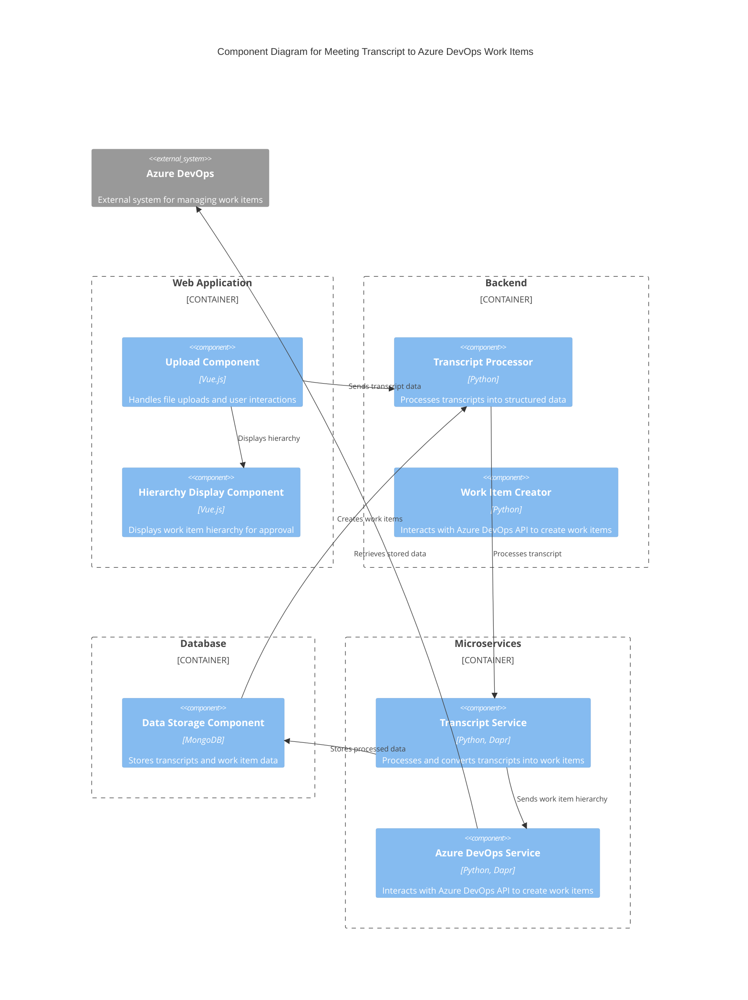

```mermaid
C4Component
title Component Diagram for Meeting Transcript to Azure DevOps Work Items

Container_Boundary(webAppBoundary, "Web Application") {
    Component(frontendComponent, "Upload Component", "Vue.js", "Handles file uploads and user interactions")
    Component(hierarchyComponent, "Hierarchy Display Component", "Vue.js", "Displays work item hierarchy for approval")
}

Container_Boundary(backendBoundary, "Backend") {
    Component(transcriptProcessor, "Transcript Processor", "Python", "Processes transcripts into structured data")
    Component(workItemCreator, "Work Item Creator", "Python", "Interacts with Azure DevOps API to create work items")
}

Container_Boundary(databaseBoundary, "Database") {
    Component(dataStorage, "Data Storage Component", "MongoDB", "Stores transcripts and work item data")
}

Container_Boundary(microservicesBoundary, "Microservices") {
    Component(transcriptServiceComponent, "Transcript Service", "Python, Dapr", "Processes and converts transcripts into work items")
    Component(azureDevOpsServiceComponent, "Azure DevOps Service", "Python, Dapr", "Interacts with Azure DevOps API to create work items")
}

System_Ext(azureDevOps, "Azure DevOps", "External system for managing work items")

Rel(frontendComponent, hierarchyComponent, "Displays hierarchy")
Rel(frontendComponent, transcriptProcessor, "Sends transcript data")
Rel(transcriptProcessor, transcriptServiceComponent, "Processes transcript")
Rel(transcriptServiceComponent, dataStorage, "Stores processed data")
Rel(transcriptServiceComponent, azureDevOpsServiceComponent, "Sends work item hierarchy")
Rel(azureDevOpsServiceComponent, azureDevOps, "Creates work items")
Rel(dataStorage, transcriptProcessor, "Retrieves stored data")
```