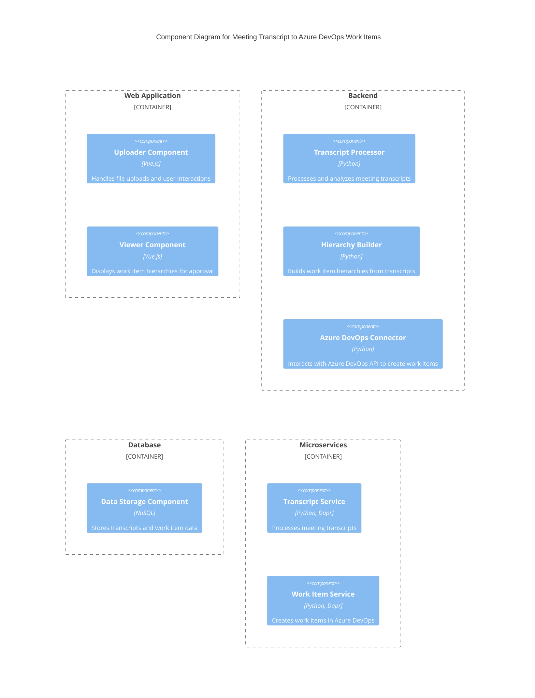

```mermaid
C4Component

title Component Diagram for Meeting Transcript to Azure DevOps Work Items

Container_Boundary(webAppBoundary, "Web Application") {
    Component(frontendUploader, "Uploader Component", "Vue.js", "Handles file uploads and user interactions")
    Component(frontendViewer, "Viewer Component", "Vue.js", "Displays work item hierarchies for approval")
}

Container_Boundary(backendBoundary, "Backend") {
    Component(transcriptProcessor, "Transcript Processor", "Python", "Processes and analyzes meeting transcripts")
    Component(hierarchyBuilder, "Hierarchy Builder", "Python", "Builds work item hierarchies from transcripts")
    Component(azureDevOpsConnector, "Azure DevOps Connector", "Python", "Interacts with Azure DevOps API to create work items")
}

Container_Boundary(databaseBoundary, "Database") {
    Component(dataStorage, "Data Storage Component", "NoSQL", "Stores transcripts and work item data")
}

Container_Boundary(microservicesBoundary, "Microservices") {
    Component(transcriptService, "Transcript Service", "Python, Dapr", "Processes meeting transcripts")
    Component(workItemService, "Work Item Service", "Python, Dapr", "Creates work items in Azure DevOps")
}
```