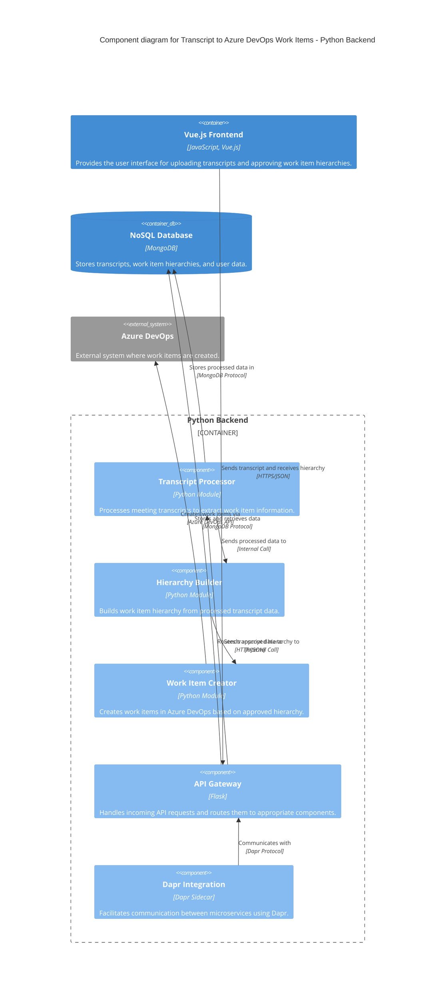

```mermaid
C4Component
title Component diagram for Transcript to Azure DevOps Work Items - Python Backend

Container(frontend, "Vue.js Frontend", "JavaScript, Vue.js", "Provides the user interface for uploading transcripts and approving work item hierarchies.")
ContainerDb(database, "NoSQL Database", "MongoDB", "Stores transcripts, work item hierarchies, and user data.")
System_Ext(azureDevOps, "Azure DevOps", "External system where work items are created.")

Container_Boundary(backend, "Python Backend") {
    Component(transcriptProcessor, "Transcript Processor", "Python Module", "Processes meeting transcripts to extract work item information.")
    Component(hierarchyBuilder, "Hierarchy Builder", "Python Module", "Builds work item hierarchy from processed transcript data.")
    Component(workItemCreator, "Work Item Creator", "Python Module", "Creates work items in Azure DevOps based on approved hierarchy.")
    Component(apiGateway, "API Gateway", "Flask", "Handles incoming API requests and routes them to appropriate components.")
    Component(daprIntegration, "Dapr Integration", "Dapr Sidecar", "Facilitates communication between microservices using Dapr.")

    Rel(apiGateway, transcriptProcessor, "Routes transcript data to", "HTTP/JSON")
    Rel(transcriptProcessor, hierarchyBuilder, "Sends processed data to", "Internal Call")
    Rel(hierarchyBuilder, workItemCreator, "Sends approved hierarchy to", "Internal Call")
    Rel(workItemCreator, azureDevOps, "Creates work items via", "Azure DevOps API")
    Rel(transcriptProcessor, database, "Stores processed data in", "MongoDB Protocol")
    Rel(daprIntegration, apiGateway, "Communicates with", "Dapr Protocol")
}

Rel(frontend, apiGateway, "Sends transcript and receives hierarchy", "HTTPS/JSON")
Rel(apiGateway, database, "Stores and retrieves data", "MongoDB Protocol")
```