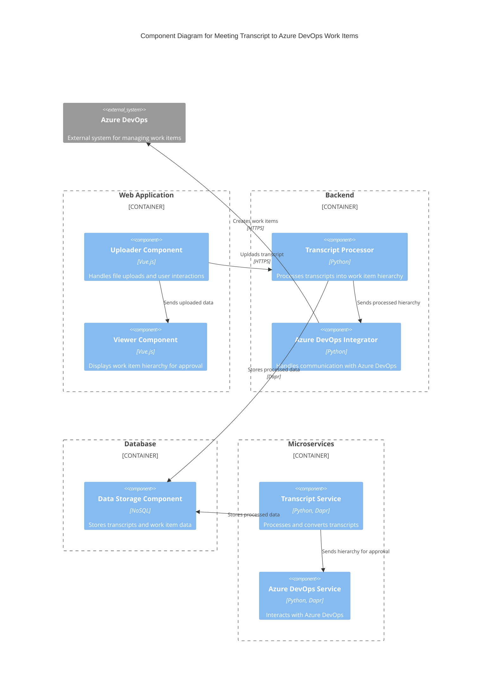

```mermaid
C4Component
title Component Diagram for Meeting Transcript to Azure DevOps Work Items

Container_Boundary(webAppBoundary, "Web Application") {
    Component(frontendUploader, "Uploader Component", "Vue.js", "Handles file uploads and user interactions")
    Component(frontendViewer, "Viewer Component", "Vue.js", "Displays work item hierarchy for approval")
    
    Rel(frontendUploader, frontendViewer, "Sends uploaded data")
}

Container_Boundary(backendBoundary, "Backend") {
    Component(transcriptProcessor, "Transcript Processor", "Python", "Processes transcripts into work item hierarchy")
    Component(azureDevOpsIntegrator, "Azure DevOps Integrator", "Python", "Handles communication with Azure DevOps")
    
    Rel(transcriptProcessor, azureDevOpsIntegrator, "Sends processed hierarchy")
}

Container_Boundary(databaseBoundary, "Database") {
    Component(dataStorage, "Data Storage Component", "NoSQL", "Stores transcripts and work item data")
}

Container_Boundary(microservicesBoundary, "Microservices") {
    Component(transcriptService, "Transcript Service", "Python, Dapr", "Processes and converts transcripts")
    Component(azureDevOpsService, "Azure DevOps Service", "Python, Dapr", "Interacts with Azure DevOps")
    
    Rel(transcriptService, azureDevOpsService, "Sends hierarchy for approval")
    Rel(transcriptService, dataStorage, "Stores processed data")
}

System_Ext(azureDevOps, "Azure DevOps", "External system for managing work items")

Rel(frontendUploader, transcriptProcessor, "Uploads transcript", "HTTPS")
Rel(transcriptProcessor, dataStorage, "Stores processed data", "Dapr")
Rel(azureDevOpsIntegrator, azureDevOps, "Creates work items", "HTTPS")

UpdateRelStyle(frontendUploader, transcriptProcessor, $offsetY="-30")
UpdateRelStyle(transcriptProcessor, dataStorage, $offsetY="-30")
UpdateRelStyle(azureDevOpsIntegrator, azureDevOps, $offsetY="-30")
```