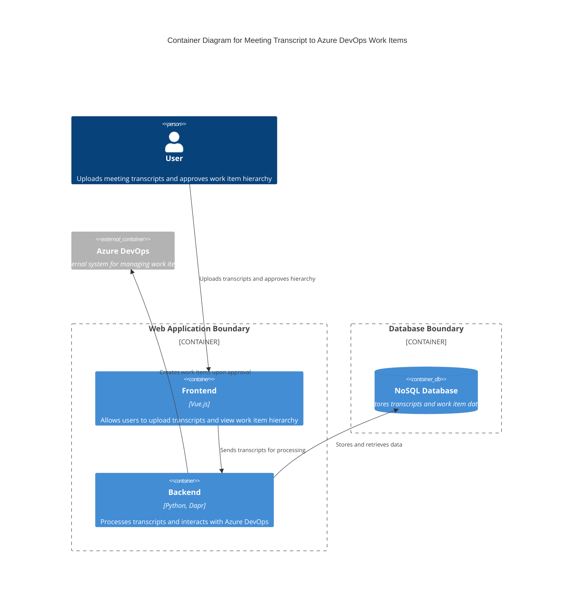

```mermaid
C4Container
title Container Diagram for Meeting Transcript to Azure DevOps Work Items

Person(user, "User", "Uploads meeting transcripts and approves work item hierarchy")

Container_Boundary(webAppBoundary, "Web Application Boundary") {
    Container(frontend, "Frontend", "Vue.js", "Allows users to upload transcripts and view work item hierarchy")
    Container(backend, "Backend", "Python, Dapr", "Processes transcripts and interacts with Azure DevOps")
}

Container_Boundary(databaseBoundary, "Database Boundary") {
    ContainerDb(database, "NoSQL Database", "Stores transcripts and work item data")
}

Container_Ext(azureDevOps, "Azure DevOps", "External system for managing work items")

Rel(user, frontend, "Uploads transcripts and approves hierarchy")
Rel(frontend, backend, "Sends transcripts for processing")
Rel(backend, database, "Stores and retrieves data")
Rel(backend, azureDevOps, "Creates work items upon approval")
```