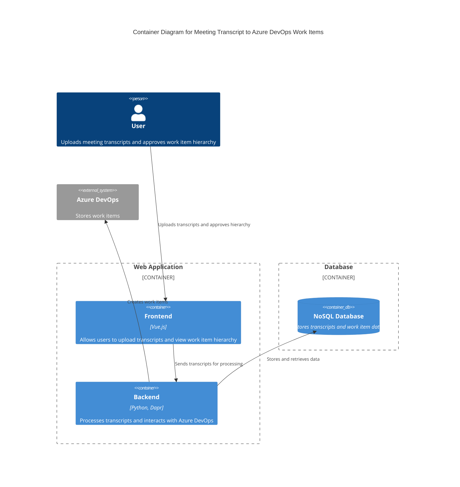

### Explanation
- **User**: Interacts with the system by uploading meeting transcripts and approving the work item hierarchy.
- **Frontend (Vue.js)**: Provides the user interface for uploading transcripts and viewing the hierarchy.
- **Backend (Python, Dapr)**: Handles the processing of transcripts, building the hierarchy, and communicating with Azure DevOps.
- **NoSQL Database**: Stores the transcripts and the resulting work item data.
- **Azure DevOps**: External system where the work items are created and managed.

This architecture is designed to handle high throughput and large data storage requirements, with scalability achieved through the use of microservices and a NoSQL database.