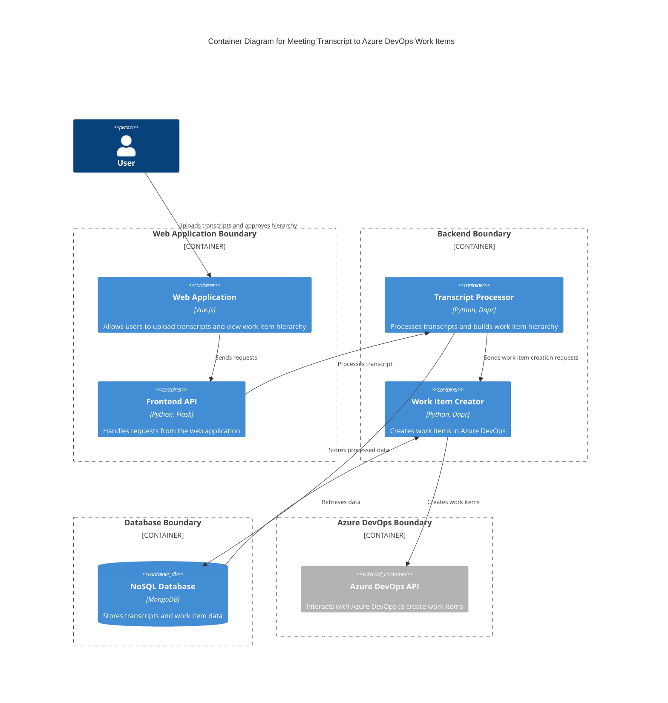

### Explanation

- **User**: Interacts with the web application to upload transcripts and approve the work item hierarchy.
- **Web Application**: Built with Vue.js, it provides the interface for users to interact with the system.
- **Frontend API**: A Python Flask application that handles requests from the web application.
- **Transcript Processor**: A microservice using Python and Dapr to process transcripts and build the work item hierarchy.
- **Work Item Creator**: Another microservice using Python and Dapr to create work items in Azure DevOps.
- **NoSQL Database**: MongoDB is used to store transcripts and work item data.
- **Azure DevOps API**: External system that the Work Item Creator interacts with to create work items.

This architecture is designed to handle high throughput and large data storage requirements, leveraging microservices and horizontal scalability.