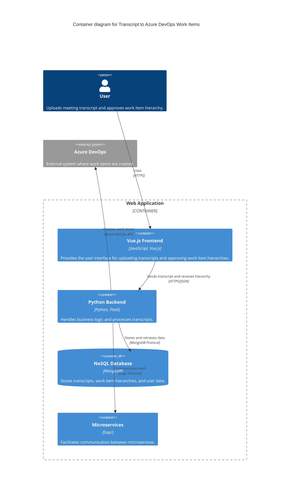

```mermaid
C4Container
title Container diagram for Transcript to Azure DevOps Work Items

Person(user, "User", "Uploads meeting transcript and approves work item hierarchy.")

Container_Boundary(webAppBoundary, "Web Application") {
    Container(frontend, "Vue.js Frontend", "JavaScript, Vue.js", "Provides the user interface for uploading transcripts and approving work item hierarchies.")
    Container(backend, "Python Backend", "Python, Flask", "Handles business logic and processes transcripts.")
    ContainerDb(database, "NoSQL Database", "MongoDB", "Stores transcripts, work item hierarchies, and user data.")
    Container(microservices, "Microservices", "Dapr", "Facilitates communication between microservices.")
}

System_Ext(azureDevOps, "Azure DevOps", "External system where work items are created.")

Rel(user, frontend, "Uses", "HTTPS")
Rel(frontend, backend, "Sends transcript and receives hierarchy", "HTTPS/JSON")
Rel(backend, database, "Stores and retrieves data", "MongoDB Protocol")
Rel(backend, azureDevOps, "Creates work items", "Azure DevOps API")
Rel(backend, microservices, "Communicates with", "Dapr Protocol")

```