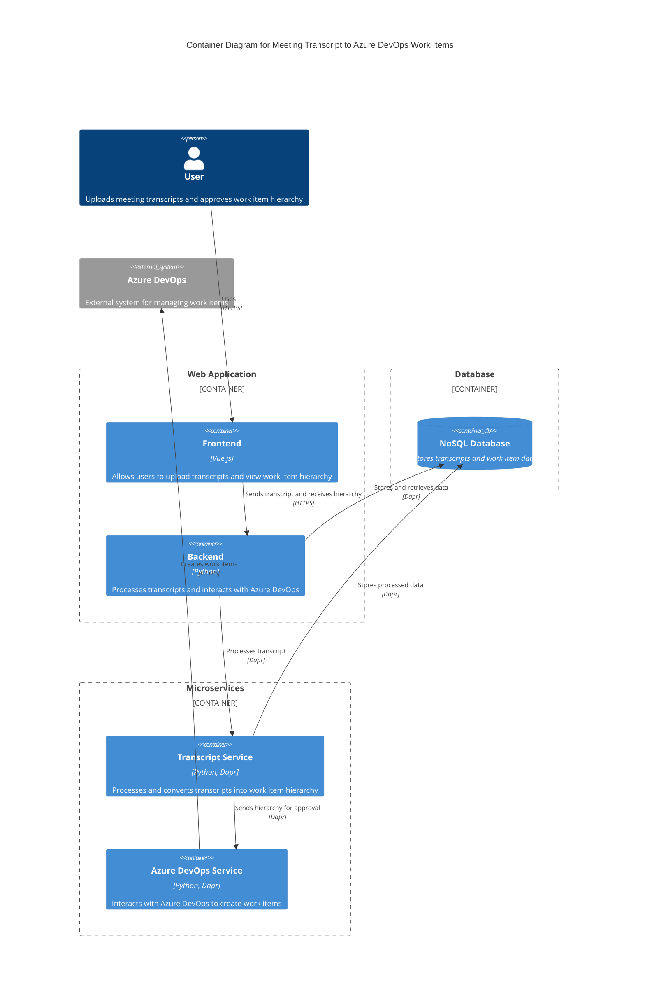

```mermaid
C4Container
title Container Diagram for Meeting Transcript to Azure DevOps Work Items

Person(user, "User", "Uploads meeting transcripts and approves work item hierarchy")

Container_Boundary(webAppBoundary, "Web Application") {
    Container(frontend, "Frontend", "Vue.js", "Allows users to upload transcripts and view work item hierarchy")
    Container(backend, "Backend", "Python", "Processes transcripts and interacts with Azure DevOps")
}

Container_Boundary(databaseBoundary, "Database") {
    ContainerDb(noSqlDb, "NoSQL Database", "Stores transcripts and work item data")
}

Container_Boundary(microservicesBoundary, "Microservices") {
    Container(transcriptService, "Transcript Service", "Python, Dapr", "Processes and converts transcripts into work item hierarchy")
    Container(azureDevOpsService, "Azure DevOps Service", "Python, Dapr", "Interacts with Azure DevOps to create work items")
}

System_Ext(azureDevOps, "Azure DevOps", "External system for managing work items")

Rel(user, frontend, "Uses", "HTTPS")
Rel(frontend, backend, "Sends transcript and receives hierarchy", "HTTPS")
Rel(backend, transcriptService, "Processes transcript", "Dapr")
Rel(transcriptService, noSqlDb, "Stores processed data", "Dapr")
Rel(transcriptService, azureDevOpsService, "Sends hierarchy for approval", "Dapr")
Rel(azureDevOpsService, azureDevOps, "Creates work items", "HTTPS")
Rel(backend, noSqlDb, "Stores and retrieves data", "Dapr")

UpdateRelStyle(user, frontend, $offsetY="-30")
UpdateRelStyle(frontend, backend, $offsetY="-30")
UpdateRelStyle(backend, transcriptService, $offsetY="-30")
UpdateRelStyle(transcriptService, noSqlDb, $offsetY="-30")
UpdateRelStyle(transcriptService, azureDevOpsService, $offsetY="-30")
UpdateRelStyle(azureDevOpsService, azureDevOps, $offsetY="-30")
UpdateRelStyle(backend, noSqlDb, $offsetY="-30")
```