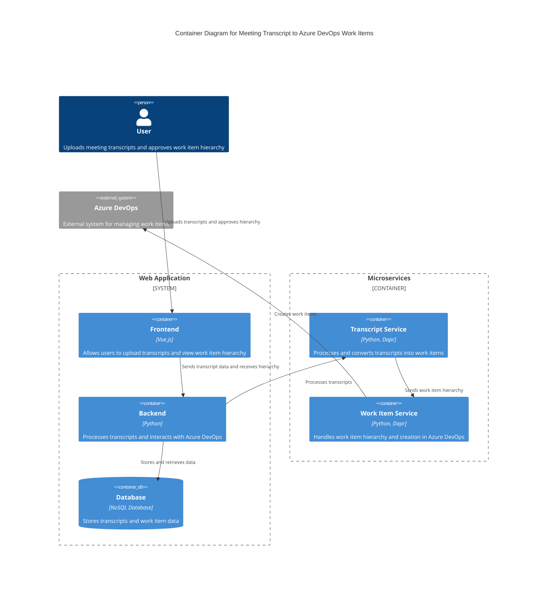

```mermaid
C4Container
title Container Diagram for Meeting Transcript to Azure DevOps Work Items

Person(user, "User", "Uploads meeting transcripts and approves work item hierarchy")

System_Boundary(webAppBoundary, "Web Application") {
    Container(frontend, "Frontend", "Vue.js", "Allows users to upload transcripts and view work item hierarchy")
    Container(backend, "Backend", "Python", "Processes transcripts and interacts with Azure DevOps")
    ContainerDb(database, "Database", "NoSQL Database", "Stores transcripts and work item data")
}

System_Ext(azureDevOps, "Azure DevOps", "External system for managing work items")

Container_Boundary(microservicesBoundary, "Microservices") {
    Container(transcriptService, "Transcript Service", "Python, Dapr", "Processes and converts transcripts into work items")
    Container(workItemService, "Work Item Service", "Python, Dapr", "Handles work item hierarchy and creation in Azure DevOps")
}

Rel(user, frontend, "Uploads transcripts and approves hierarchy")
Rel(frontend, backend, "Sends transcript data and receives hierarchy")
Rel(backend, database, "Stores and retrieves data")
Rel(backend, transcriptService, "Processes transcripts")
Rel(transcriptService, workItemService, "Sends work item hierarchy")
Rel(workItemService, azureDevOps, "Creates work items")

UpdateRelStyle(user, frontend, $offsetY="-30")
UpdateRelStyle(frontend, backend, $offsetY="-30")
UpdateRelStyle(backend, database, $offsetX="-50")
UpdateRelStyle(backend, transcriptService, $offsetX="50")
UpdateRelStyle(transcriptService, workItemService, $offsetY="30")
UpdateRelStyle(workItemService, azureDevOps, $offsetX="50")
```