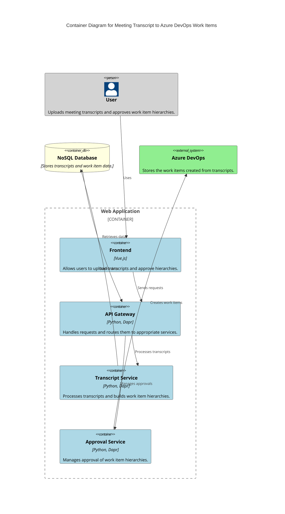

```mermaid
C4Container
title Container Diagram for Meeting Transcript to Azure DevOps Work Items

Person(user, "User", "Uploads meeting transcripts and approves work item hierarchies.")

Container_Boundary(webAppBoundary, "Web Application") {
    Container(frontend, "Frontend", "Vue.js", "Allows users to upload transcripts and approve hierarchies.")
    Container(apiGateway, "API Gateway", "Python, Dapr", "Handles requests and routes them to appropriate services.")
    Container(transcriptService, "Transcript Service", "Python, Dapr", "Processes transcripts and builds work item hierarchies.")
    Container(approvalService, "Approval Service", "Python, Dapr", "Manages approval of work item hierarchies.")
}

ContainerDb(database, "NoSQL Database", "Stores transcripts and work item data.")

System_Ext(azureDevOps, "Azure DevOps", "Stores the work items created from transcripts.")

Rel(user, frontend, "Uses")
Rel(frontend, apiGateway, "Sends requests")
Rel(apiGateway, transcriptService, "Processes transcripts")
Rel(apiGateway, approvalService, "Manages approvals")
Rel(transcriptService, database, "Stores data")
Rel(approvalService, azureDevOps, "Creates work items")
Rel(database, apiGateway, "Retrieves data")

UpdateElementStyle(user, $fontColor="black", $bgColor="lightgrey", $borderColor="black")
UpdateElementStyle(frontend, $fontColor="black", $bgColor="lightblue", $borderColor="black")
UpdateElementStyle(apiGateway, $fontColor="black", $bgColor="lightblue", $borderColor="black")
UpdateElementStyle(transcriptService, $fontColor="black", $bgColor="lightblue", $borderColor="black")
UpdateElementStyle(approvalService, $fontColor="black", $bgColor="lightblue", $borderColor="black")
UpdateElementStyle(database, $fontColor="black", $bgColor="lightyellow", $borderColor="black")
UpdateElementStyle(azureDevOps, $fontColor="black", $bgColor="lightgreen", $borderColor="black")
```