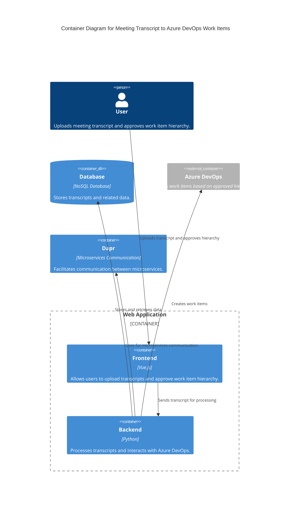

```mermaid
C4Container
    title Container Diagram for Meeting Transcript to Azure DevOps Work Items

    Person(user, "User", "Uploads meeting transcript and approves work item hierarchy.")

    Container_Boundary(webAppBoundary, "Web Application") {
        Container(frontend, "Frontend", "Vue.js", "Allows users to upload transcripts and approve work item hierarchy.")
        Container(backend, "Backend", "Python", "Processes transcripts and interacts with Azure DevOps.")
    }

    ContainerDb(database, "Database", "NoSQL Database", "Stores transcripts and related data.")
    Container_Ext(azureDevOps, "Azure DevOps", "Creates work items based on approved hierarchy.")
    Container(dapr, "Dapr", "Microservices Communication", "Facilitates communication between microservices.")

    Rel(user, frontend, "Uploads transcript and approves hierarchy")
    Rel(frontend, backend, "Sends transcript for processing")
    Rel(backend, azureDevOps, "Creates work items")
    Rel(backend, database, "Stores and retrieves data")
    Rel(backend, dapr, "Uses for microservices communication")
```