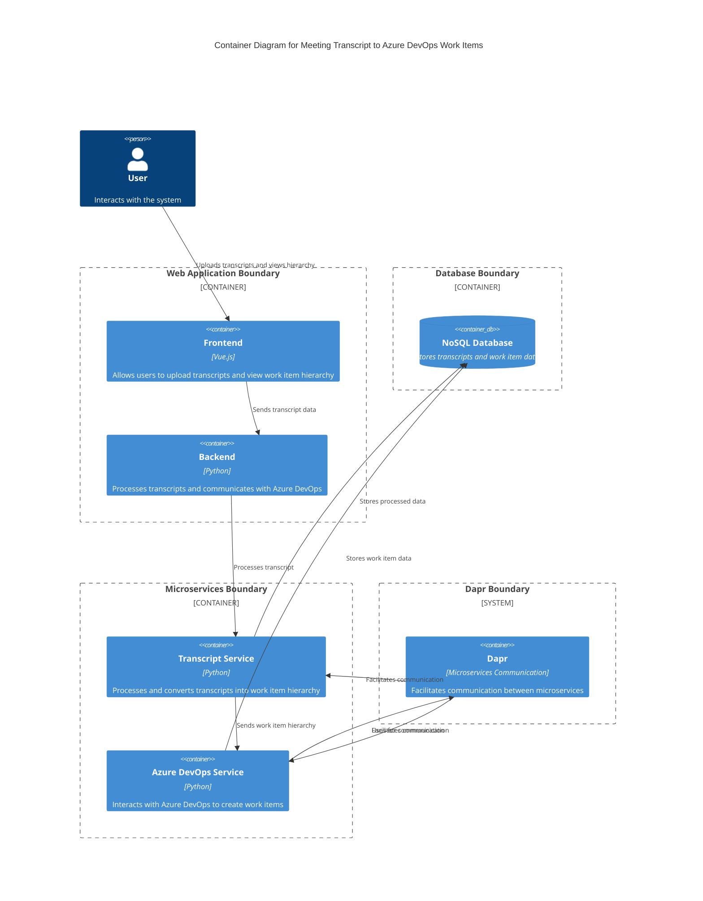

```mermaid
C4Container
title Container Diagram for Meeting Transcript to Azure DevOps Work Items

Person(user, "User", "Interacts with the system")

Container_Boundary(webAppBoundary, "Web Application Boundary") {
    Container(frontend, "Frontend", "Vue.js", "Allows users to upload transcripts and view work item hierarchy")
    Container(backend, "Backend", "Python", "Processes transcripts and communicates with Azure DevOps")
}

Container_Boundary(databaseBoundary, "Database Boundary") {
    ContainerDb(database, "NoSQL Database", "Stores transcripts and work item data")
}

Container_Boundary(microservicesBoundary, "Microservices Boundary") {
    Container(transcriptService, "Transcript Service", "Python", "Processes and converts transcripts into work item hierarchy")
    Container(azureDevOpsService, "Azure DevOps Service", "Python", "Interacts with Azure DevOps to create work items")
}

System_Boundary(daprBoundary, "Dapr Boundary") {
    Container(dapr, "Dapr", "Microservices Communication", "Facilitates communication between microservices")
}

Rel(user, frontend, "Uploads transcripts and views hierarchy")
Rel(frontend, backend, "Sends transcript data")
Rel(backend, transcriptService, "Processes transcript")
Rel(transcriptService, database, "Stores processed data")
Rel(transcriptService, azureDevOpsService, "Sends work item hierarchy")
Rel(azureDevOpsService, database, "Stores work item data")
Rel(azureDevOpsService, dapr, "Uses for communication")
Rel(dapr, transcriptService, "Facilitates communication")
Rel(dapr, azureDevOpsService, "Facilitates communication")
```