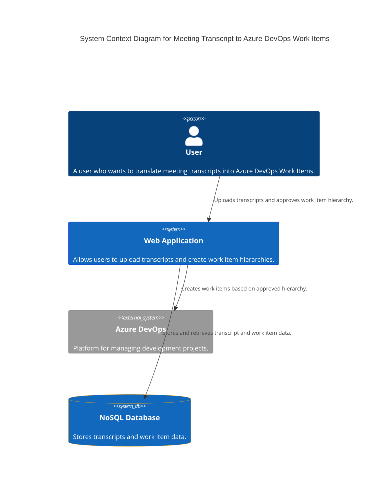

### Explanation

- **User**: The person who interacts with the system to translate meeting transcripts into Azure DevOps Work Items.
- **Web Application**: The main system that allows users to upload transcripts, build work item hierarchies, and create work items in Azure DevOps.
- **Azure DevOps**: An external system where the work items are created and managed.
- **NoSQL Database**: Used to store transcripts and work item data, supporting horizontal scaling and large data storage.

The web application is built using Vue.js for the frontend and Python for the backend, utilizing Dapr for microservices to ensure scalability and performance.