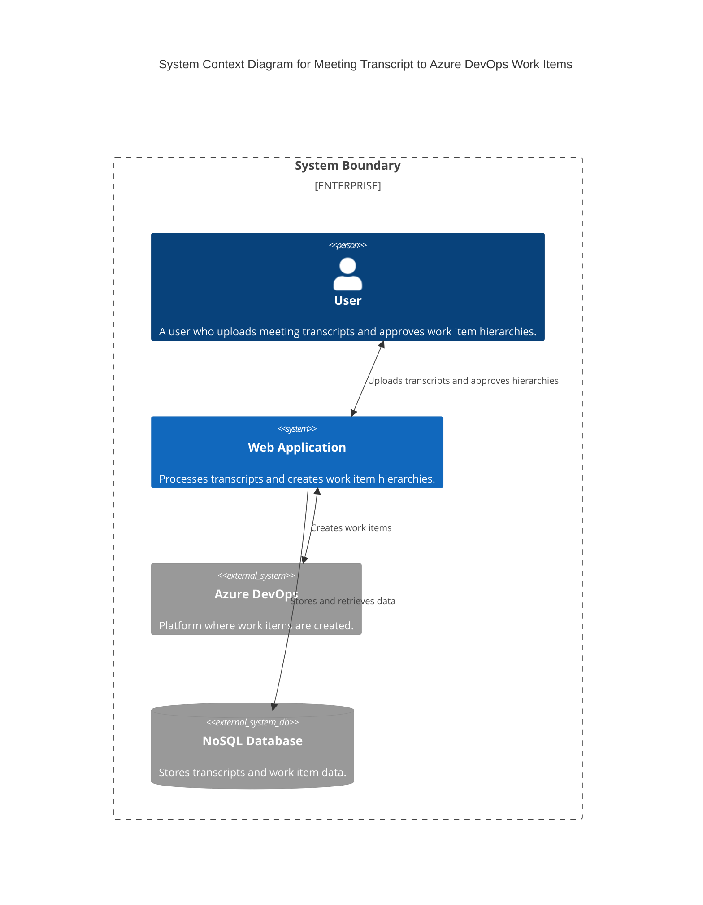

```mermaid
C4Context
  title System Context Diagram for Meeting Transcript to Azure DevOps Work Items

  Enterprise_Boundary(b0, "System Boundary") {
    Person(user, "User", "A user who uploads meeting transcripts and approves work item hierarchies.")

    System(webApp, "Web Application", "Processes transcripts and creates work item hierarchies.")
    
    System_Ext(azureDevOps, "Azure DevOps", "Platform where work items are created.")
    
    SystemDb_Ext(noSqlDb, "NoSQL Database", "Stores transcripts and work item data.")
  }

  BiRel(user, webApp, "Uploads transcripts and approves hierarchies")
  BiRel(webApp, azureDevOps, "Creates work items")
  Rel(webApp, noSqlDb, "Stores and retrieves data")
```
