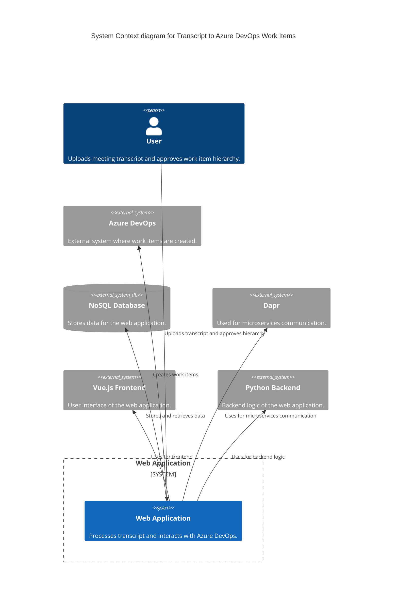

```mermaid
C4Context
  title System Context diagram for Transcript to Azure DevOps Work Items

  Person(user, "User", "Uploads meeting transcript and approves work item hierarchy.")

  System_Boundary(webAppBoundary, "Web Application") {
    System(webApp, "Web Application", "Processes transcript and interacts with Azure DevOps.")
  }

  System_Ext(azureDevOps, "Azure DevOps", "External system where work items are created.")
  SystemDb_Ext(noSqlDb, "NoSQL Database", "Stores data for the web application.")
  System_Ext(dapr, "Dapr", "Used for microservices communication.")
  System_Ext(vueJs, "Vue.js Frontend", "User interface of the web application.")
  System_Ext(pythonBackend, "Python Backend", "Backend logic of the web application.")

  Rel(user, webApp, "Uploads transcript and approves hierarchy")
  Rel(webApp, azureDevOps, "Creates work items")
  Rel(webApp, noSqlDb, "Stores and retrieves data")
  Rel(webApp, dapr, "Uses for microservices communication")
  Rel(webApp, vueJs, "Uses for frontend")
  Rel(webApp, pythonBackend, "Uses for backend logic")
```