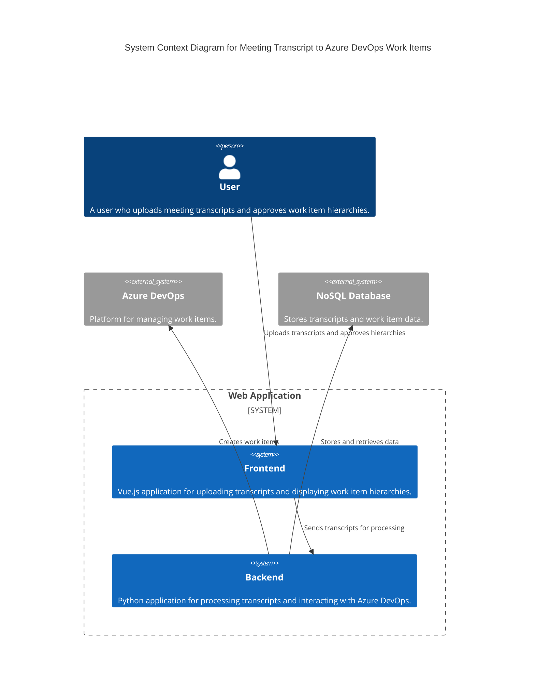

### Explanation

- **User**: Interacts with the system by uploading meeting transcripts and approving the generated work item hierarchy.
- **Web Application**: Consists of a frontend and backend.
  - **Frontend**: Built with Vue.js, it allows users to upload transcripts and view the work item hierarchy.
  - **Backend**: Developed in Python, it processes the transcripts, builds the hierarchy, and communicates with Azure DevOps.
- **Azure DevOps**: External system where the work items are created.
- **NoSQL Database**: Used to store transcripts and work item data, supporting horizontal scaling and large data storage.
