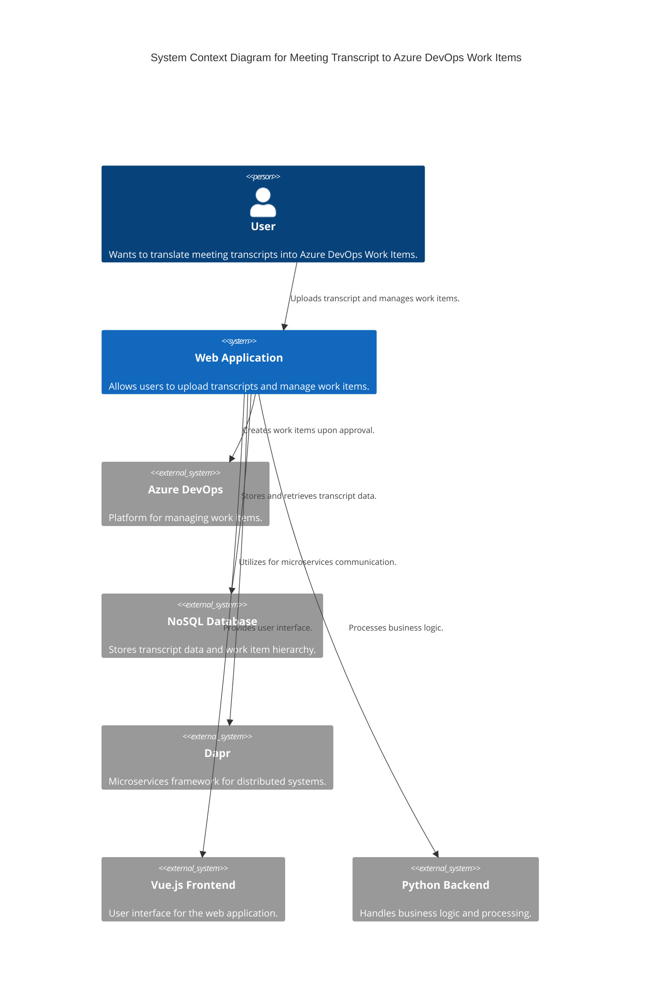

### Explanation

- **User**: The person who wants to translate meeting transcripts into Azure DevOps Work Items.
- **Web Application**: The main system where users upload transcripts and manage work items.
- **Azure DevOps**: External system where work items are created and managed.
- **NoSQL Database**: Used to store transcript data and work item hierarchy.
- **Dapr**: Used for microservices communication within the system.
- **Vue.js Frontend**: Provides the user interface for the web application.
- **Python Backend**: Handles the business logic and processing of transcripts.