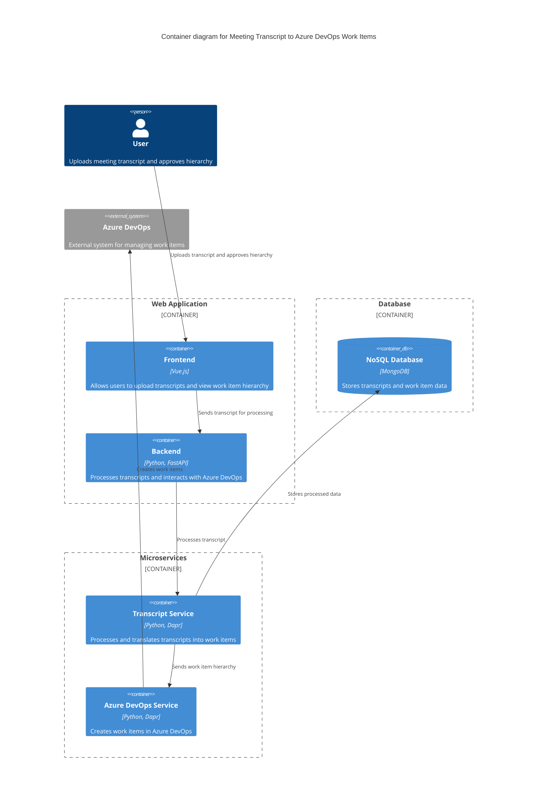

### Explanation

- **User**: Interacts with the system by uploading meeting transcripts and approving the generated work item hierarchy.
- **Frontend**: Built with Vue.js, it provides the user interface for uploading transcripts and viewing the work item hierarchy.
- **Backend**: Developed in Python using FastAPI, it handles the processing of transcripts and communication with Azure DevOps.
- **NoSQL Database**: MongoDB is used to store transcripts and work item data, supporting horizontal scaling and large data storage.
- **Transcript Service**: A microservice responsible for processing transcripts and translating them into a work item hierarchy.
- **Azure DevOps Service**: A microservice that creates work items in Azure DevOps based on the approved hierarchy.
- **Azure DevOps**: The external system where work items are managed.

This architecture is designed to handle high throughput and large data storage, leveraging microservices with Dapr for scalability and resilience.