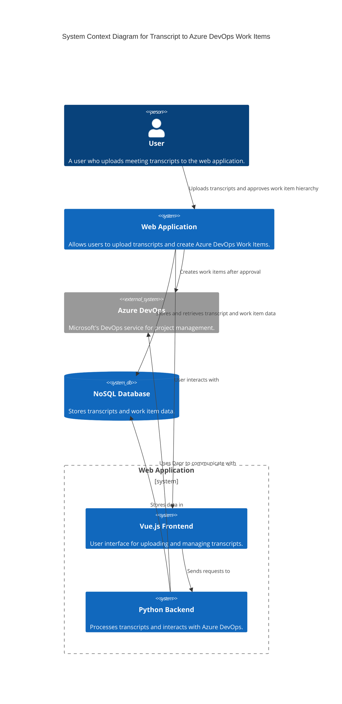

```mermaid
C4Context
    title System Context Diagram for Transcript to Azure DevOps Work Items

    Person(user, "User", "A user who uploads meeting transcripts to the web application.")

    System(webApp, "Web Application", "Allows users to upload transcripts and create Azure DevOps Work Items.")
    System_Ext(azureDevOps, "Azure DevOps", "Microsoft's DevOps service for project management.")
    SystemDb(database, "NoSQL Database", "Stores transcripts and work item data.")

    Rel(user, webApp, "Uploads transcripts and approves work item hierarchy")
    Rel(webApp, azureDevOps, "Creates work items after approval")
    Rel(webApp, database, "Stores and retrieves transcript and work item data")

    Boundary(b1, "Web Application") {
        System(frontend, "Vue.js Frontend", "User interface for uploading and managing transcripts.")
        System(backend, "Python Backend", "Processes transcripts and interacts with Azure DevOps.")
    }

    Rel(webApp, frontend, "User interacts with")
    Rel(frontend, backend, "Sends requests to")
    Rel(backend, azureDevOps, "Uses Dapr to communicate with")
    Rel(backend, database, "Stores data in")
```