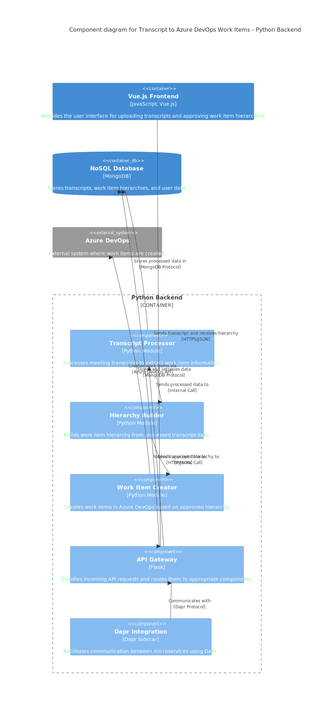

### Explanation

- **Upload Component**: Handles file uploads from users.
- **Hierarchy Viewer**: Displays the work item hierarchy for user approval.
- **Request Handler**: Manages incoming requests from the web application.
- **Authenticator**: Handles user authentication.
- **Transcript Parser**: Parses the uploaded transcript.
- **Hierarchy Builder**: Constructs the work item hierarchy.
- **Work Item Service**: Interacts with Azure DevOps API to create work items.
- **Data Storage**: MongoDB component for storing transcripts and hierarchy data.
- **Azure DevOps Connector**: Facilitates interaction with Azure DevOps API.

This diagram provides a detailed view of the components within each container and their interactions, following the C4 model principles.